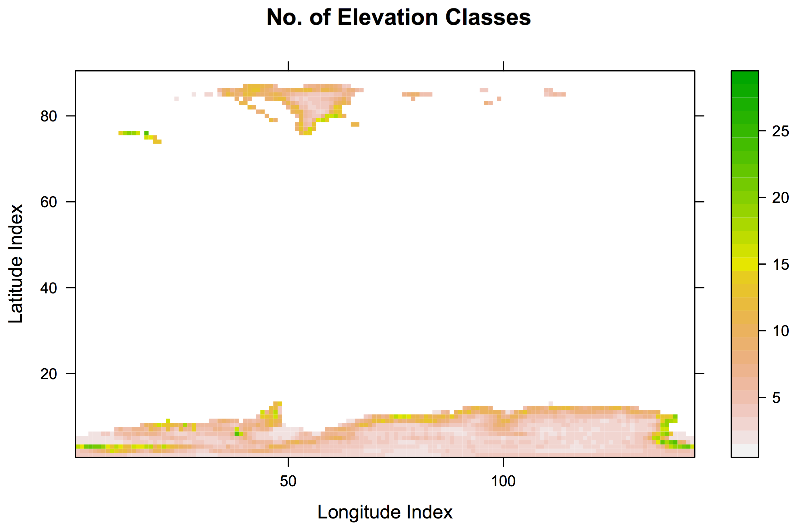

topo/: Elevation-Class Enabled TOPO Files
=========================================

This project produces Elevation Class-enabled TOPO files for use in
ModelE.  By default, it produces one based on the following:

#. Ice elevations from `ETOPO1 <https://ngdc.noaa.gov/mgg/global/global.html>`.
#. Ice sheet extents (Greenland and Antarctica) from ETOPO1.
#. Ice fractions, other than ice sheets, from ``Z10MX10M`` input file.

.. note::

   #. This project is able to remove Greenland from the TOPO file, if
      needed, for use with two-coupling.  The current incarnation,
      intended for no coupling, leaves Greenland in place.

Creating the TOPO File
----------------------

To run this project, which creates an elevation class-enabled TOPO file:

.. code-block:: console

   $ cd topo
   $ make topoa.nc

The multi-step procedure can be summarized as follows.  Note that ALL
output files are written in the current directory (``topo/``):

#. Convert some ModelE input files from class Fortran format to NetCDF.

#. Convert the (hand-drawn and compressed) Grenland Mask (included
   with this repository) to NetCDF.  This is used to optionally mask
   out Greenland when generating TOPO files, so a model-generated
   Greenland can be used in its place.  (Note that masking out
   Antarctica is easy by latitude).

#. Create a Greenland Mask on the ETOPO1 1-mintue grid.

#. Regenerate the ETOPO1 data with Greenland masked.

#. Generate a global map of 1-minute ice extent, ice elevation and
   ocean mask (``etopo1_ice_g1m.nc``).  This is the direct input to
   the elevation class generator.  Users wishing to generate elevation
   classes for other ice configurations should make an analog to this
   file using other techniques as appropriate.

#. Generate a classic TOPO file on the Ocean grid (``topoo.nc``)

#. Generate elevation class definitions (``glboal_ec_mm.nc``).  Note
   that these definitions can be used for any application requiring
   elevation classes; they are simply the regridding matrices between
   the GCM (Atmosphere), Ice and Elevation grids.

#. Generate an enhnaced TOPO file on the Atmosphere grid
   (``topoa.nc``).  Note that this must be in NetCDF classic
   (NetCDF 3) format for ModelE, which will read it using the
   ``pnetcdf`` system.

For more information, see documentation on:

* `IceBin <http://icebin.readthedocs.io>`_

TOPO File Format
----------------

To enable elevation classes, the TOPO file format has been extended
with new variables to describe those elevation classes.  New portions
of the file are:

.. code-block:: none

   dimensions:
           nhc = 34 ;
   variables:
           int info ;
                   info:segments = "legacy,land,ec" ;
           double fhc(nhc, jm, im) ;
           double elevE(nhc, jm, im) ;
           double underice(nhc, jm, im) ;

.. note::

   Indices in this document are written in order of descending stride,
   as is conventional for NetCDF.  Fortran code using these variables
   will reverse the index order.

ModelE loads ``fhc``, ``elevE`` and ``underice`` into variables of the
same name, which are used to control the simulation at two points in
ModelE; remembering that the snow/firn model is run in elevation class
space:

Elevation Class Control
```````````````````````

ModelE supports a maximum of ``nhc`` elevation classes per grid cell,
where each elevation class represents a particular portion of the grid
cell's ice, at a particular elevation.  The number of elevation
classes required for a grid cell depends on the range of elevation
present in the topography in that grid cell: areas of steep gradient
near the edges of ice sheets will use many elevation classes, whereas
flatter areas in the interior will use few.  This diagram shows the
number of elevation classes used, per grid cell, for a recent TOPO
file:



Every elevation class at every grid cell may be enabled or disabled.
Elevation classes with ``fhc(ihc,j,i)==0`` are disabled; all others
are enabled.

.. note::

   To disable an elevation class, ``fhc`` must be set explicitly to
   zero.  Do not assume that the result of some floating point
   computation will equal zero, roundoff issues could cause problems.
   An elevation class with ``fhc=1e-200`` is NOT disabled.


Downscale Atmosphere
````````````````````

The variable ``eleveE`` provides the elevation of each elevation
class, and is used when downscaling the atmosphere.

The ModelE atmosphere provides average atmospheric conditions for an
entire grid cell, which must be applied to all the (enabled) elevation
classes within that grid cell.  This is done by adjusting the
atmopsheric conditions (temperature, pressure, humidity) based on the
difference between the elevation of an elevation class vs. the mean
elevation of the grid cell using known physical principles such as
lapse rate, exponential decrease in pressure, etc.  For details, see
``subroutine downscale_pressure_li`` and ``subroutine
downscale_pressure_li`` in ``SURFACE_LANDICE.f`` (ModelE repository).

.. note::

   #. Also look at where these are called in ``SURFACE.f``: a number
      of variables used in a surface mass/energy balance are not
      downscaled by elevation class, including various heat fluxes,
      precipitation, evaporation, etc.

   #. This process is called *downscaling*, not regridding, because
      *relevant physical knowledge* is added to a lower-resolution field
      to create something at higher resolution that is consistent with
      the original.

Sum over Elevation Classes
``````````````````````````

The variable ``fhc`` specifies the fraction of ice in a grid cell
apportioned to that elevation class.

After ModelE is done running the snow/firn model, it must report
quantities back to the atmosphere.  These quantities are computed on a
per-grid-cell basis by summing up the quantities provided by the
snow/firn model on a per-elevation-class basis, using weights from
``fhc``.

.. note::

   #. Summing over ``fhc`` is done for *all elevation classes*.  If an
      elevation class is turned off and ``fhc==0``, then it will
      contribute nothing to the sum.

   #. ``fhc`` must sum to 1 within each grid cell.

Elevation Class Segments
````````````````````````

Three ways to run ModelE with elevation classes have been developed.
We call each way a *segment*:

#. *legacy*: There is exactly one elevation class per grid cell, with
   ``fhc=1`` and ``elevE`` equal to the mean elevation of the grid
   cell.  This produces the same result as previous version of ModelE
   that were not elevation class enabled.  Note that the downscaling
   procedures here have no effect, since the elevation of the
   elevation class is the same as that of the overall grid cell.

#. *sealand*: The *legacy* segment produces biases at the coasts
   [Alexander et al 2018].  This problem can be fixed by setting the
   ``elevE`` to the mean elevation of the *ice-covered* region of the
   grid cell, rather than of the overall grid cell.  This is done of
   the single elevation class in the *sealand* segment.

#. *ec*: A number of elevation classes are used, based on the
   high-resolution topography of the ice sheet.

It is frequently useful to run multiple segments at once; for example
to determine the effects of elevation classes within a setting
[Alexander et al 2018].  In this case, elevation classes of all
segments can be stacked against each other in the TOPO file's ``fhc``.
For example, if the segments *legacy*, *sealand* and *ec* are used
together in a TOPO file, then the *legacy* segment will use index
``ihc=0``, *sealand* will use index ``ihc=1`` and *ec* will use the
rest of the elevation class indices.

The result of summing over elevation classes will be slightly
different depending on which segment is used, due to non-linearities
in the snow/firn model; but typically not very different.  Therefore,
it is reasonable to sum over only one segment while running all
segments in parallel.  The segment being summed over is called the
*prognostic segment*, whereas the others are called *diagnostic
segments*.

Which segment is prognostic vs. diagnostic is controled entirely by
the value of ``fhc`` for the segment.  By default, TOPO files are
generated in which the *ec* segment is prognostic and the others are
diagnostic.  ``fhc`` is multiplied by ``1e-30`` for diagnostic
segments, thus preventing them from having any effect when summing
over elevation classes.

.. note::

   #. ModelE does not "know" about segments.  It simply sums over
   *all* elevation classes, assuming that weights sum to 1.  Segments
   are set to diagnostic by multiplying ``fhc`` by ``1e-30`` within
   that segment.

Other Variables
```````````````

The ``underice`` variable tells ModelE what is UNDERNEATH each elevation class:

* ``underice==0``: Elevation class not used.
* ``underice==1``: This elevation class contributes to a dynamic ice model.
* ``underice==2``: No dynamic ice modle is underneath this ice.

This variable is only used when coupling with a dynamic ice model.  For non-coupled case, ``underice=0`` should be used where ``fhc==0`` (i.e. an elevation class is turned off); and ``underice=1`` should be used elsewhere.

Running with ModelE
-------------------

The main ModelE program in the *e3/landice* branch of the repository
varies its behavior with respect to elevation classes based *entirely*
on the contents of the TOPO file.  No additional rundeck parameters
are needed to make elevation classes work.  ModelE auto-senses the
intent of the TOPO file as follows:

Classic TOPO File
`````````````````

If the variables ``fhc`` and ``elevE`` are not present, then ModelE
assumes a classic, non-elevation class TOPO file.  It self-configures
with a single elevation class (``nhc=1``), setting ``fhc=1`` for grid
cells that involve ice, and ``elevE=ZATMO``.  This transparently
replicates the behavior of past ModelE versions without elevation
class support.

Elevation Class Enabled TOPO File
`````````````````````````````````

If the variables ``fhc`` and ``elevE`` *are* present, then ModelE uses
them as given, taking ``nhc`` from the TOPO file.  This enables an
elevation class run without requiring any additional user changes to
the rundeck.  Elevation class segments will be whatever was set up in
the TOPO file.
